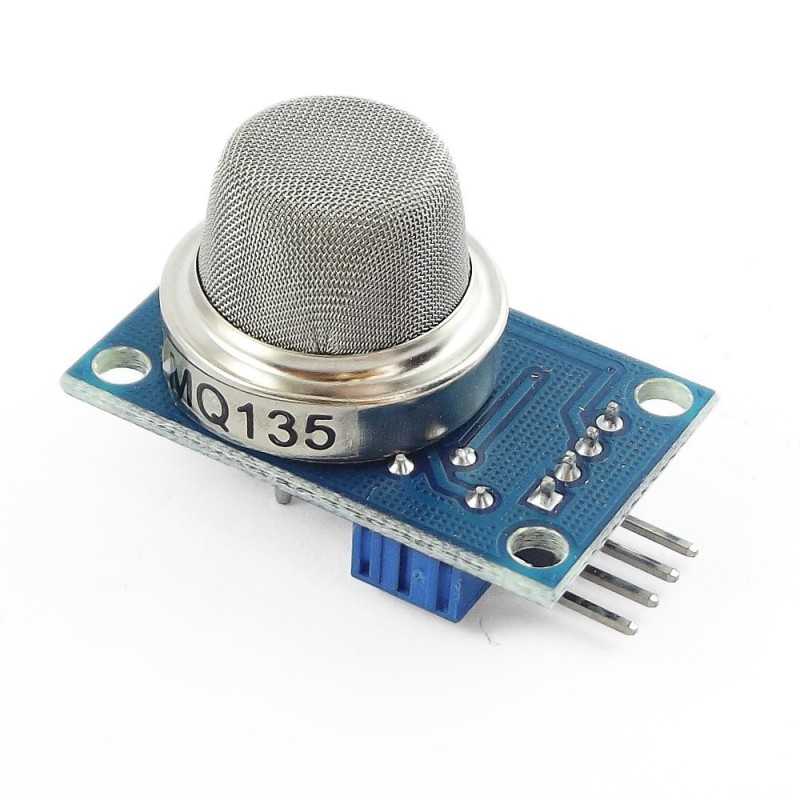
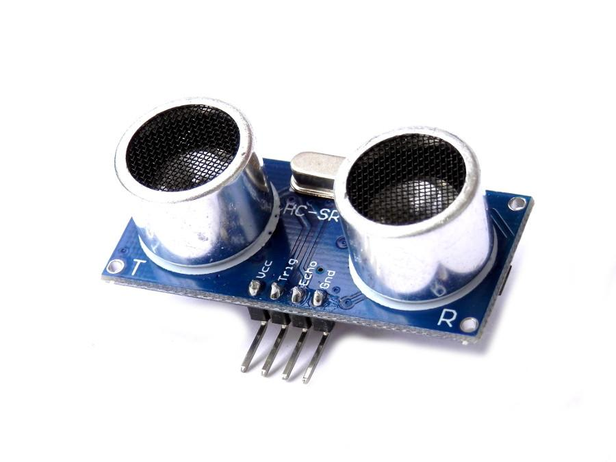
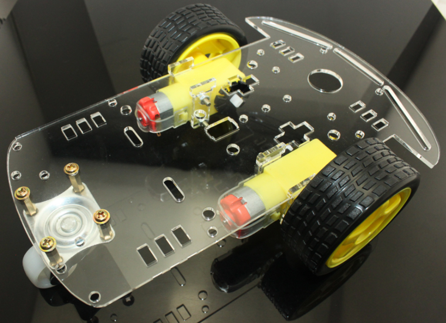
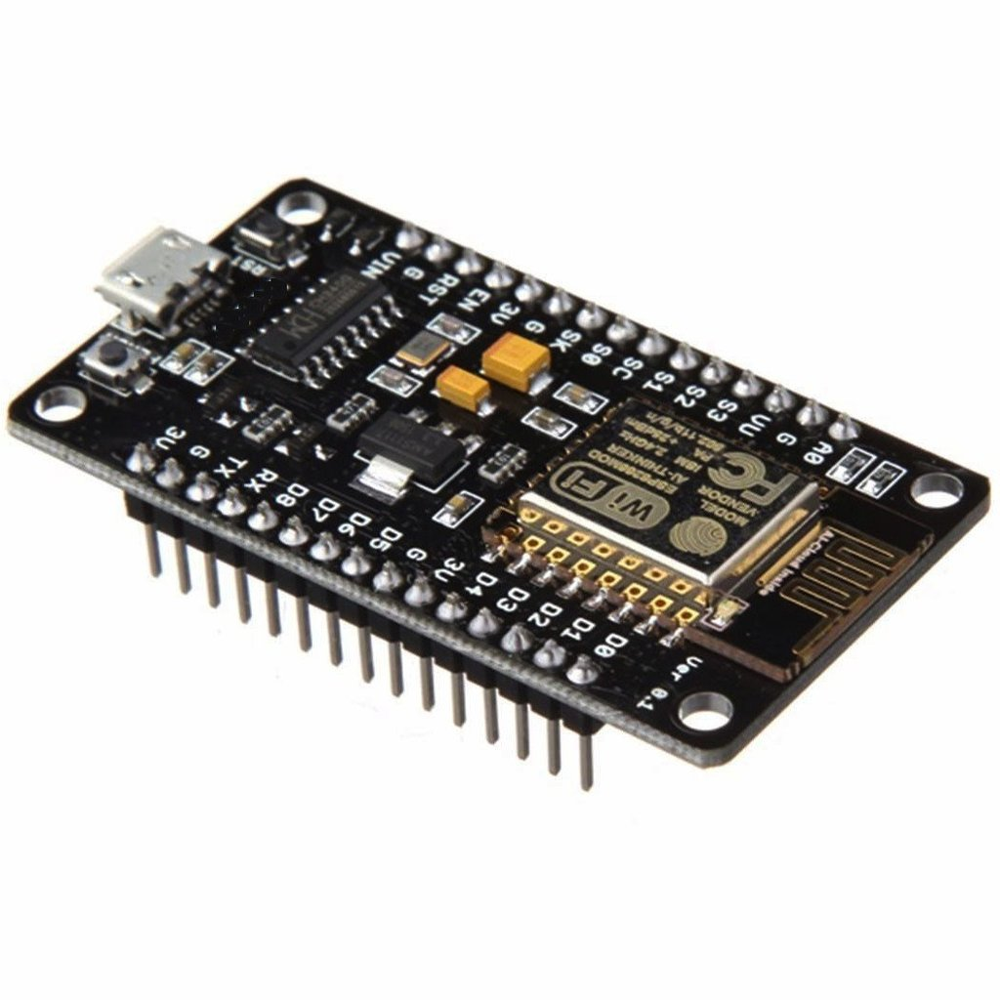
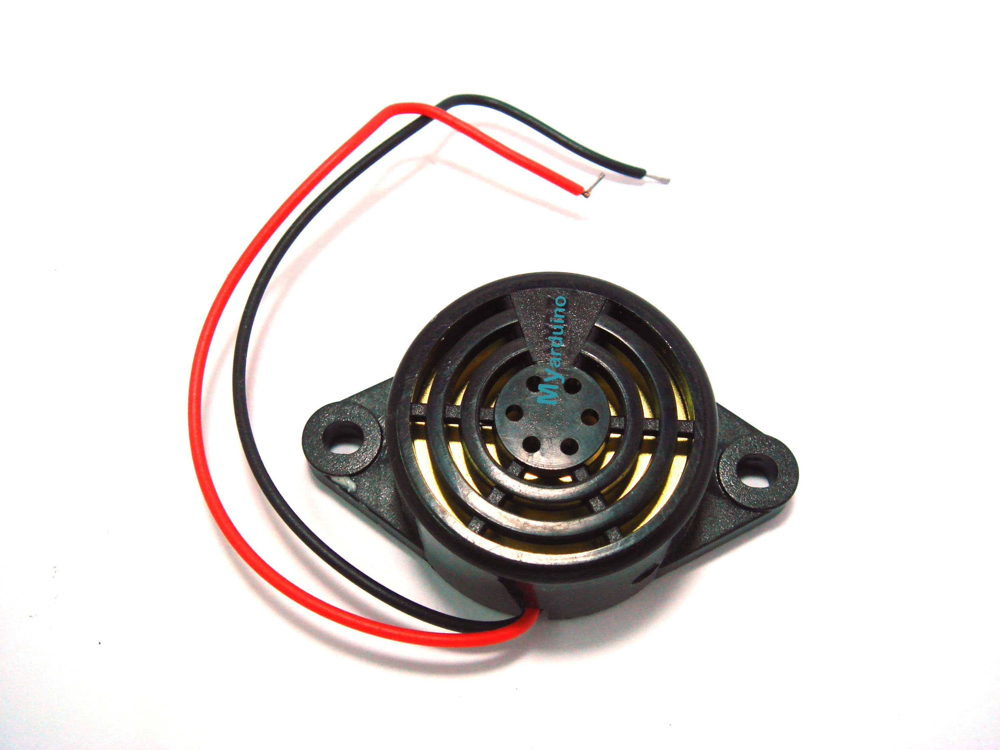
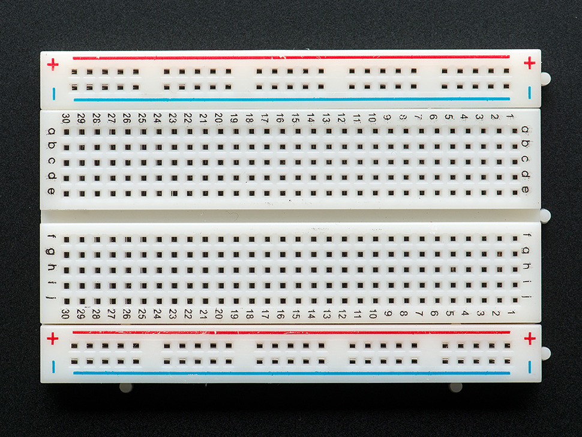
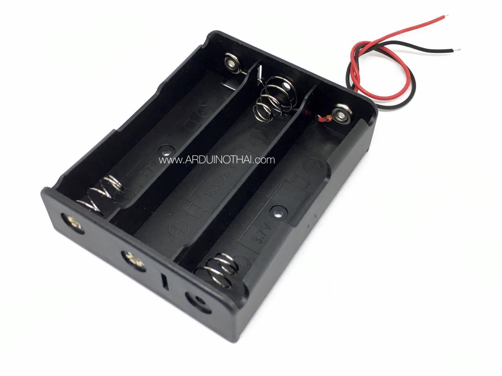
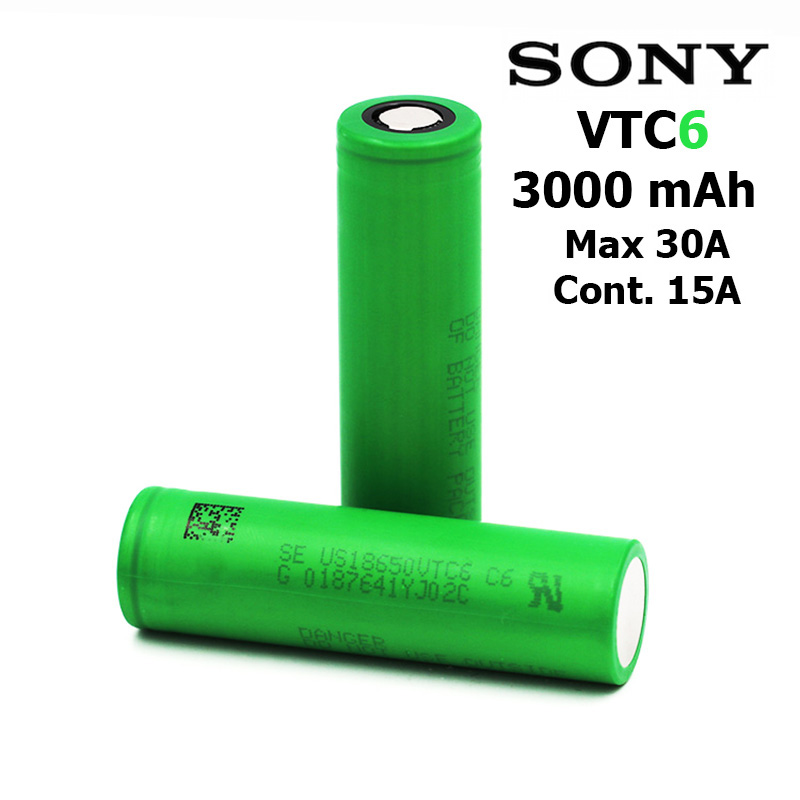
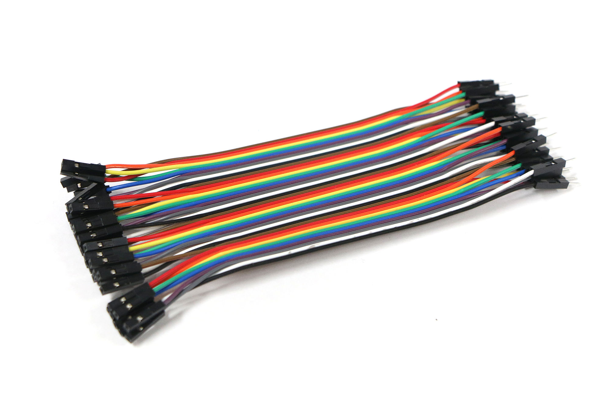

# Air-pollution-detector

   - Project Computer Programming 2/2560

## Introduction
&nbsp;&nbsp;&nbsp;&nbsp;&nbsp;&nbsp;&nbsp;&nbsp;สวัสดีครับวันนี้กลุ่ม air pollution detector เราได้สร้างเครื่องตรวจจับมลพิษทางอากาศโดยใช้เซ็นเซอร์ MQ135 ที่นำไปใช้กับการตรวจหามลพิษทางอากาศสามารถทำงานได้จริงโดยเครื่องตรวจจับอากาศเราจะนำมาใส่ในรถเพื่อเพิ่มความสะดวกในการตรวจจับอากาศโดยเราไม่ต้องเอาเครื่องไปวางตรวจตามจุดต่างๆเองแต่เราจะใช้ให้รถไปตรวจจับแทนเราหรือเราอาจจะนำเครื่องไปวางตามจุดต่างๆเองก็ได้โดยปิดสวิสซ์ที่รถวิ่งและเปิดแค่power bankแทนอีกทั้งเรายังสามารถส่งข้อมูลขึ้นเว็บนอกจากนี้ตัวโปรแกรมที่ใช้บังคับรถและเครื่องตรวจจับอากาศยังสร้างจากโปรแกรมarduinoโดยการใช้เพียงภาษา C และ C# ในการเขียน
## Required Components

MQ135 Gas sensor | Arduino Uno | สาย usb arduino | ultrasonic module hc-sr04 | 16X2 LCD 
:-: | :-: | :-: | :-: | :-:
  |  |  |  | 

l298n motor driver module | โครงรถหุ่นยนต์ smart car 2wd robot car | nodemcu esp8266 | ลําโพงอิเล็กทรอนิกส์สัญญาณเตือนภัยออดไฟฟ้า dc 3-24v
:-: | :-: | :-: | :-:
  |  |  |  

Breadboard | power bank | ที่ใส่ถ่าน | ถ่านลิเทียม18650 3 ก้อน | สายไฟจัมเปอร์
:-: | :-: | :-: | :-: | :-:
  |  |  |  | 

## Board Connection

| motor driver module      | arduino uno ตัวที่ 1  |  
| --------------- |:-------------:|       
| out1 	           | DC MOTOR +            |
| out2             | DC MOTOR -            |
| out3             | DC MOTOR +          |
| out4             | DC MOTOR -          |
| 5V 	          |  5V            |
| GND            | GND และ รางถ่านขั้ว -        |
| 12v             | รางถ่านขั้ว +           |
| ENA             | 6           |
| IN1 	          | 3            |
| IN2            | 2            |
| IN3             | 4           |
| IN4             | 7           |
| ENB             | 5           |

| ultrasonic ฝั่งซ้าย      | arduino uno ตัวที่ 1  |  
| --------------- |:-------------:|       
| GND 	          | GND            |
| ECHO             | 13            |
| TRIG             | 12           |
| VCC             | 5V           |

| ultrasonic ฝั่งขวา      | arduino uno ตัวที่ 1  |  
| --------------- |:-------------:|       
| GND 	          |  GND            |
| ECHO             | 9            |
| TRIG             | 8           |
| VCC             | 5V           |

| รางถ่าน      | arduino uno ตัวที่ 1  |  
| --------------- |:-------------:|       
| สายสีแดง 	          | DC MOTOR  12V    |
| สายสีดำ             | GND            |

| nodemcu esp8266      | arduino uno ตัวที่ 2  |  
| --------------- |:-------------:|       
| D2	          | 10            |
| D3             | 11            |
| VCC             | 3V3           |
| GND             | GND           |

| MQ135      | arduino uno ตัวที่ 2  |  
| --------------- |:-------------:|       
| A0 	          | A0            |
| D0             | -            |
| VCC             | 5V           |
| GND             | GND           |

| MQ7      | arduino uno ตัวที่ 2  |  
| --------------- |:-------------:|       
| A0 	          |  A1            |
| D0             | -            |
| VCC             | 5V           |
| GND             | GND           |

| จอLCD      | arduino uno ตัวที่ 2  |  
| --------------- |:-------------:|       
| SDA 	          |  A4            |
| SCL             | A5            |
| VCC             | 5V           |
| GND             | GND           |

| dc 3-24v     | arduino uno ตัวที่ 2  |  
| --------------- |:-------------:|       
| สายสีแดง 	          |  8            |
| สายสีดำ             | GND            |

## Project features
&nbsp;&nbsp;&nbsp;&nbsp;&nbsp;&nbsp;&nbsp;&nbsp; เราจัดทำเครื่องตรวจจับมลพิษทางอากาศเพื่อตรวจสอบมลพิษทางอากาศหรือควันซึ่งจะตรวจสอบคุณภาพอากาศโดยการที่รถจะวิ่งไปเรื่อยๆเพื่อตรวจมลพิษทางอากาศและส่งค่าขึ้นเว็บเซิร์ฟเวอร์และเมื่อตรวจเจอมลพิษทางอากาศก็จะส่งสัญญาณเตือนออกมาเพื่อแสดงให้เห็นว่าบริเวณนั้นมีมลพิษทางอากาศเช่น CO2, ควันแอลกอฮอล์เบนซินและ NH3 จะแสดงคุณภาพอากาศบนหน้าจอ LCD และบนหน้าเว็บเพื่อให้เราสามารถตรวจสอบได้อย่างง่ายดาย
## Library in Use
- SoftwareSerial.h
- Wire.h
- LiquidCrystal_I2C.h
- ESP8266WiFi.h
- FirebaseArduino.h
## How to use
1. กดปุ่มpower bankเพื่อตรวจมลพิษบริเวณนั้นๆแต่ถ้าหากต้องการตรวจมลพิษบริเวณรอบๆโดยก้าวอย่างทั่วถึงกรุณากดปุ่มเปิดสวิตซ์เพื่อให้รถวิ่งตรวจจับมลพิษทางอากาศ
2. หากต้องการทราบค่ามลพิษทางอากาศสามารถเข้าไปได้ที่เว็บไซต์ https://fireboard.xyz/show--L9iaffbAl42tGB9JfzH.html
## Team Members
| | รหัสนักศึกษา        | ชื่อ | นามสกุล |
|:-:| :-------------: |:----------:|:--------:|
|  | 60070007    | นายคาซูยา | โคมัทซึ |
|  | 60070024      | นางสาวณัฐปภัสร์  | อยู่ยง |
|  | 60070025      | นายณัฐวุฒิ  | เตชะศรีบูรพา |

## Assistant Teacher
- ผศ. ดร. กิติ์สุชาติ พสุภา
- ผศ. ดร. ปานวิทย์ ธุวะนุติ
 &nbsp;&nbsp;&nbsp;&nbsp;&nbsp;&nbsp;รายงานนี้เป็นส่วนหนึ่งของวิชา Computer Programming (รหัส 06016206)
 เทคโนโลยีสารสนเทศ สถาบันเทคโนโลยีพระจอมเกล้าเจ้าคุณทหารลาดกระบัง

